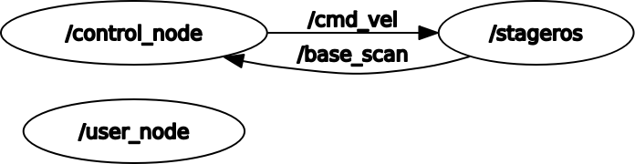

#  Research track 1, assignment 2

## Description of the assignment

In this assignment a mobile robot has to move inside a predefined map following a circuit and avoiding touching the border of the circuit.
An user can interact with the robot and modify the speed of the robot, and reset its position. 
The implementation of the environment is done using ROS.
 
## How to run the code
from a linux shell launch as first the ROS master
```
roscore
```
then launching the node that control the world
```
rosrun stage_ros stageros $(rospack find second_assignment)/world/my_world.world
```
now you can launch the two node, one for the control and one for the user interface
```
rosrun a2_code control_node
rosrun a2_code user_node
```

## Structure of the package
In package second_assignment is contained all the code necessary for the generation of the world and the robot. It is also present several service and topic useful for the controlling and the interfacing with the robot.
In package **a2_code** are contained the two node implemented for the controlling of the motion of the robot and the user interface.
 It is also present an additional service 'Userparameter.srv' used for passing the parameter given by the user to the control node.
 The code is divided in two ROS node:

**control_node:**
handle the subscription and the publication on the two topic for getting the laser scan output and for gives to the robot the velocity to follow.
In this node is also contained the implementation of the server for handling the Userparameter service.

**user_node:**
handle the interface with the user and, using the service Userparameter, communicate with the control node.




## Control scheme

Subscribing to topic /base_scan the control node can obtain the distance of the closest obstacle in front of the robot and also on the 2 side with a FOV of 180 degrees.
publishing on topic /cmd_vel the control node can directly provide the "next step" linear and angular velocity to the robot.
The control scheme is divided in two parallel loop one for the linear velocity and the other one for the angular velocity.
The controller for the linear velocity is an proportional controller based on the distance of the object directly in front of the robot
 


The controller for the angular velocity is proportional controller with one element of memory, is designed to keep the heading of the robot in the direction of the farthest obstacle. Using this controller the robot always try to turn in the direction of the circuit, avoiding touching the wall of the circuit. The angle to be followed is slightly correct in order to avoid contact with the wall in case of hard corner. the correction modify the heading angle in the opposite direction w.r.t. the closest wall.


 
where, alpha is the corrected drift angle between the heading of the robot and the vector to the farthest obstacle.
Note that the laser scan on the robot has a limit distance, whether a measured is equal to the maximum distance that is considered as the distance from the farthest obstacle.
Angle alpha is obtained taking the index of the greatest value in the distance array published on topic /base_scan.

## User interface
The user interface is provided by a specific node '/user_node'. The use can operate on a multiplicative coefficient that will be applied directly to the linear velocity value computed by the control node.
The user also can reset the robot to its initial position, this can be done both while to robot is moving or if the robot had hit a wall.


<!--stackedit_data:
eyJoaXN0b3J5IjpbLTE3NTU3MTk3NjRdfQ==
-->
